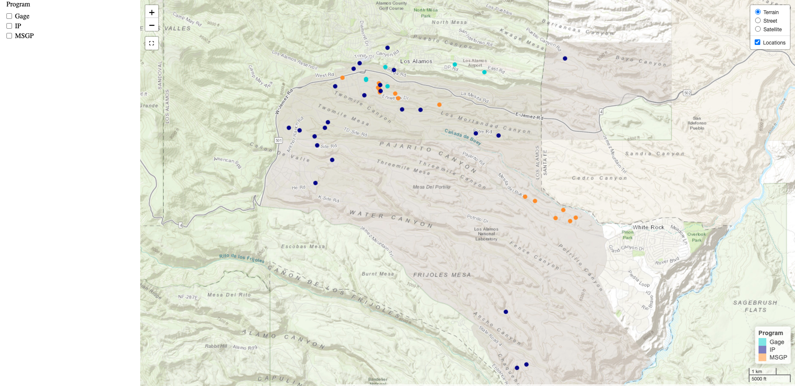

# Sample Location Webmap
R script to create an interactive Leaflet webmap of environmental stormwater sampling locations by program and by year. Data is publicly available on the Intellus New Mexico website (https://www.intellusnm.com/index.cfm). All data are unclassified.

---

## Overview
This project builds an interactive webmap using R and `leaflet`.  It reads Intellus 2023 stormwater sample location data, converts it to `sf`, and creates a web-based visualization with popups showing site details.

---

## Tools & Libraries
- `leaflet` — interactive mapping  
- `sf` — spatial data handling  
- `dplyr` — data wrangling  
- `here` — reproducible paths  
- `htmlwidgets` — export to HTML

---

## Key Script
[**sampled_locations_Intellus_2024.R**](https://github.com/r-lyon/sample-location-webmap/blob/main/scripts/sampled_locations_Intellus_2024.R)

---

## Example Output


---

## Project Structure
- `scripts/`: Contains the R script to create the webmap.
- `data/`: Contains the raw data file downloaded from Intellus New Mexico.
- `output/`: Contains the html output file

---

## Requirements
- R
- R libraries: `tidyverse', 'lubridate', 'sf', 'crosstalk', 'leaflet', 'htmlwidgets', 'htmltools', 'jsonlite', 'httr'

---

## How to Run the Project
1. Clone the repository:
   ```sh
   git clone https://github.com/r-lyon/sample-location-webmap.git
   cd sample-location-webmap
2. Open the R script in RStudio or your preferred R environment.
3. Ensure the necessary libraries are installed.
4. Run the script to generate the results.

**Author:** Russ Lyon  
*Environmental Scientist | GIS & Data Visualization*